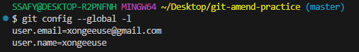

# 240711

Python Track Public Documents는 [여기를 클릭하세요](https://abit.ly/pb-document)

## 1. Markdown
>마크다운(markdown)은 일반 텍스트 기반의 경량 마크업 언어다. 

일반 텍스트로 서식이 있는 작성하는 데 사용되며, 일반 마크업 언어에 비해 문법이 쉽고 간단한 것이 특징이다. HTML 등 서식 문서로 쉽게 변환되기 때문에 README 파일이나 온라인 게시물 등에 많이 사용된다. 

### 마크다운 문법

1. 제목
    ```
    # 제목의 형태로 위계 표현 
    ## 제목2
    ###### 제목6 까지 가능
    ```


2. 리스트 작성
    - 순서가 있는 경우
        ```
        1. 어쩌구
            1. ㅇㅇ
            2. ㅁㅁ 
        2. 저쩌구
            1. ㅇㅇ
            2. ㅁㅁ 
        ```    
     - 순서가 없는 경우
        ```
        - 어쩌구
        - 저쩌구
            - ㅇㅇ
            - ㅁㅁ
        ```
3. 코드블럭          
    *`은 백틱이라고 부릅니다.*

- 코드블럭 (`3개와 함께 열고 닫기)

    코드 시작점에 사용하는 언어를 선언하여 문법강조가 가능하다. (필수는 아님)

    ```python
    print('hello')
    print("world")
    ```

- 인라인 코드블럭 (`1개와 함께 열고 닫기)

    Python은 `print` 함수를 사용해 텍스트를 출력한다.

4. 하이퍼링크
- [Google](https://www.google.com)
    ``` 
    [Google](googlelink)
    [Google](https://www.google.com)
    ```

- 이미지 링크

    

    ```
    
    
    ```

5. 강조, 이탤릭, 취소선
    ```
    *기울임*
    **굵게**
    ***기울임+굵게***
    ~~취소선~~
    ```
    *기울임*
    **굵게**
    ***기울임+굵게***
    ~~취소선~~

6. 수평선
    ```
    ---
    ```

---

7. 표 만들기
    ```
    <!-- Markdown -->
    Title1|Title2
    -|-
    content1|content2
    content3|content4
    
    Title1|Title2|Title3
    :-|:-:|-:
    content1|content2|content3
    ```

    <!-- Markdown -->
    Title1|Title2
    -|-
    content1|content2
    content3|content4
    
    Title1|Title2|Title3
    :-|:-:|-:
    content1|content2|content3

<!-- Html -->
<figure>
    <table>
        <thead>
            <tr>
                <th>Title1</th>
                <th>Title2</th>
            </tr>
        </thead>
        <tbody>
            <tr>
                <td>content1</td>
                <td>content2</td>
            </tr>
            <tr>
                <td>content3</td>
                <td>content4</td>
            </tr>
        </tbody>
    </table>
</figure>
  
<figure>
    <table>
        <thead>
            <tr>
                <th style='text-align:left;' >Title1</th>
                <th style='text-align:center;' >Title2</th>
                <th style='text-align:right;' >Title3</th>
            </tr>
        </thead>
        <tbody>
            <tr>
                <td style='text-align:left;' >content1</td>
                <td style='text-align:center;' >content2</td>
                <td style='text-align:right;' >content3</td>
            </tr>
        </tbody>
    </table>
</figure>

#### 8. 이모지
[💡 링크 참조](https://gist.github.com/rxaviers/7360908)

## 2. CLI

### CLI(Command Line Interface) 

>명령어를 통해 사용자와 컴퓨터가 상호 작용하는 방식


### GUI(Graphic User Interface)

>그래픽을 통해 사용자와 컴퓨터가 상호 작용하는 방식

### CLI 명령어
- `touch` 파일 생성
- `mkdir` (makedirectory) 새 디렉토리(폴더) 생성
- `ls` (list) 현재 작업 중인 디렉토리 내부의 폴더/파일 목록 출력
- `ls -a` 숨김폴더까지 출력
- `cd` 현재 작업 중인 디렉토리 변경(위치 이동)
- `cd ..` 상위 디렉토리 이동 (../.. 혹은 ../layer1 형태도 가능)
- `start` 폴더/파일 열기
- `code` 코드 파일로 열기
- `rm` 파일 삭제 
- `rm -r` 디렉토리 삭제
- `pwd` (Print Working Directory) 현재 작업 위치 확인

    *파일/폴더명 첫글자 치고 tab하면 자동완성 가능*

### 경로
> CLI에서 가장 중요한 것 - ***내가 어디 있는지(경로) 알아야 한다!***

- 절대경로

    Root 디렉토리부터 목적지점까지 거치는 모든 경로를 전부 작성한 것

- 상대경로
    
    현재 작업하고 있는 디렉토리 기준으로 계산된 상대적 위치 작성한 것

   


## 3. Git
>깃(Git)은 분산 버전 관리 프로그램

### Git의 3가지 영역
- *Working directory* (작업 디렉토리)
    
    현재 작업 중인 파일들이 위치하는 영역

- *Staging area*

    Working directory에서 변경된 파일 중, 다음 버전에 포함시킬 파일들을 선택적으로 추가하거나 제외할 수 있는 중간 준비 영역, like 임시 저장소

- *Repository* (저장소)

    버전 이력과 파일들이 영구적으로 저장되는 영역, 모든 버전과 변경 이력이 기록됨

### Git 명령어

- `git init`    로컬 저장소 설정(초기화), git의 버전 관리를 시작할 디렉토리에서 진행 

    ***(master) 뜨는지 확인***

    *git 로컬 저장소 내에 또 다른 git 로컬 저장소를 만들지 말 것 - 혹시 그런 일이 있다면 .git 폴더 지워 주세요.*

- `git add` 

    변경사항이 있는 파일을 staging area에 추가
- `git commit -m 'message 작성'`

    staging area에 있는 파일들을 저장소에 기록, 해당 시점의 버전을 생성하고 변경 이력을 남기는 것

- `git commit --amend` 
    
    바로 직전에 작성한 커밋 메시지 수정 가능
    1. `i` 누르고 에디터 모드에서 수정
    2. `esc` 누르고
    3. `:wq` 저장 후 종료 


- `git status`

    현재 로컬 저장소의 파일 상태 보기

- `git log`

    commit history 보기 `git log --oneline` 하면 한 줄로 보기 가능
    
- `git config --global -l` 현재 사용 중인 global 파라미터 값 확인



