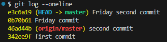
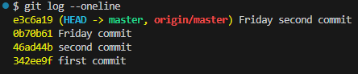
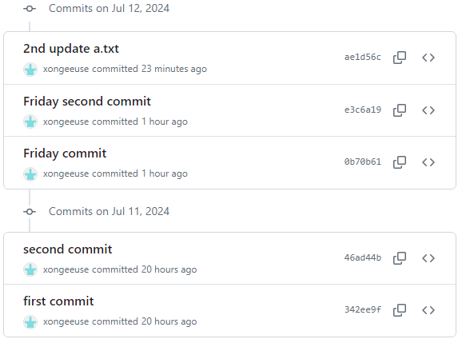

# 240712

## Remote Repository (원격 저장소)
> 코드와 버전 관리 이력을 *온라인 상의 특정 위치*에 저장하여 여러 개발자가 협업하고 코드를 공유할 수 있는 저장 공간
`ex. GitLab, GitHub, Bitbucket`

#### 로컬 저장소에서 원격 저장소로 가지고 오는 방법
##### 💡 기억해야 할 3가지  `add` > `commit` > `push`

    원격 저장소에는 commit이 올라가는 것. commit 이력이 없다면 push 할 수 없다.

- `git remote add origin remote_repo_url` : 로컬 저장소에 원격 저장소 추가
        
        - `origin`은 추가하는 원격 저장소의 별칭이지만 `origin`으로 통일하는 것이 관행
        - `remote_repo_url` 에 추가하는 원격 저장소 주소

- `git push origin master` : 원격 저장소에 commit 목록을 업로드

        "git아, push해줘 origin이라는 이름의 원격 저장소에 master라는 이름의 브랜치를."

     

    `git push origin master` 이후 `HEAD` 변경 내역 확인

    

    원격저장소 `commit history`에서 내역 확인 가능

    

#### 원격 저장소에서 로컬 저장소로 가지고 오는 방법

- `git pull origin master` : 원격 저장소의 *변경사항만*을 받아옴 ***(업데이트)***
        
        로컬에 깃 폴더가 있을 때

- `git clone remote_repo_url` : 원격 저장소 *전체*를 복제 ***(다운로드)***
        
        clone으로 받은 프로젝트는 이미 git init이 되어 있음
        로컬에 깃 폴더가 없을 때 ex. 처음으로 프로젝트를 다운받아야 하는 신입

- `git remote -v` 현재 로컬 저장소에 등록된 원격 저장소 목록 보기

- `git remote rm 원격_저장소_이름` 현재 로컬 저장소에 등록된 원격 저장소 삭제 (연결만 해제하는 것)

#### gitignore
> git에서 특정 파일이나 디렉토리를 추적하지 않도록 설정하는 데 사용되는 텍스트 파일

프로젝트에 따라 공유하지 않아야 하는 것들도 존재하기 때문
1. `touch` `.gitignore` 파일 생성
2. `a.txt`, `b.txt` 생성
3. `.gitignore` 파일에 `a.txt` 입력
4. `git init` 

이미 git의 관리를 받은 이력이 있는 파일은...안돼..

- gitignore 목록 생성 서비스 링크는 [여기](https://www.toptal.com/developers/gitignore)

## GitHub 활용하기

- TIL(Today I learned)*을 통해 내가 학습하는 것을 기록

    매일 내가 배운 것을 마크다운으로 정리해서 문서화하는 것
- 개인, 팀 프로젝트 코드를 공유
    
    개발 면접 지원 시 본인의 GitHub 주소를 공유해 어떤 프로젝트를 진행했고 어떤 코드를 작성했는지 공유하고 평가 받기 위해 사용
- 오픈 소스 프로젝트에 기여
- cheat sheet는 [여기](https://training.github.com/downloads/ko/github-git-cheat-sheet/)

## GitHub 프로파일 꾸미기 (구글링 해보세요!)

## [부록] Git Undoing
### Git revert 
`git revert <commit id>`
>특정 commit을 없었던 일로 만드는 것
기록에서 commit이 사라지지는 않음

    - 변경 사항을 안전하게 실행 취소할 수 있도록 도와주는 순방향 실행 취소 작업
    - commit 기록에서 commit을 삭제하거나 분리하는 대신, 지정된 변경 사항을 반전시키는 새 commit을 생성
    - git에서 기록이 손실되는 것을 방지하며 기록의 무결성과 협업의 신뢰성을 높임

### Git reset 
***위험!!!!!***
> "되돌리기" - 특정 commit으로 되돌아 갔을 때, 되돌아간 commit 이후의 commit은 모두 삭제

.svg?cdnVersion=1931)
- `--soft` 삭제된 commit의 기록을 staging area에 남김
- `--mixed` 삭제된 commit의 기록을 working directory에 남김 (기본 옵션 값)
- `--hard` 삭제된 commit의 기록을 남기지 않음
                
         `git reflog` HEAD가 이전에 가리켰던 모든 commit을 보여줌
         `--hard` 옵션을 통해 지워진 commit도 reflog로 조회하여 복구 가능

#### Git restore & remove
[더 알아보고싶니?](https://www.atlassian.com/git/tutorials/undoing-changes/git-rm)
- `git restore --staged` modified 상태의 파일 되돌리기

    - git 저장소에 commit 존재하는 경우
    - Working Directory에서 파일을 수정한 뒤, 파일의 수정 사항을 취소하고, 원래 모습대로 되돌리는
    

 - `git rm --cached`
    
    - git 저장소에 commit이 없는 경우
    - to unstage and remove paths only from the staging area
    