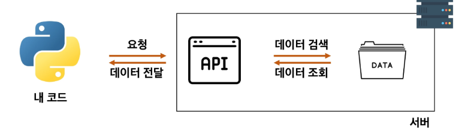

# 240719

## 📌관통 프로젝트 소개

- 매주 PJT01 > PJT02> ... > PJ10 까지 진행
- 주차마다 연계될 수도, 아닐 수도...
- 시간이 있다면 both 진행 가능
- 추후 두 가지 과제 중 하나 선택하여 진행 (이전까지 자유롭게 변경 가능)

    - 버전 1 : 금융 상품 비교 앱

    - 버전 2 : 영화 추천 서비스

#### 전문 용어 이해하기
- 서버 : 부탁을 받으면 처리해주거나, 부탁대로 원하는 값을 돌려주는 역할
- 클라이언트 : 부탁하는 역할

1. 클라이언트가 정보를 달라고 요청하면
2. 서버는 클라이언트의 요청에 따라 원하는 정보를 돌려준다.

#### 요청을 보내는 두 가지 방법
1. 웹에서 주소(URL) 입력

2. 서버에 정보 요청하는 파이썬 코드 작성
    - `requests` 파이썬에서 서버에 요청을 보낼 수 있는 도구 (브라우저처럼 서버로 요청을 보낼 수 있는 패키지)

    - `pip install requests` 설치 
    - `pip list` 목록 확인
    - `url` 요청을 보내는 서버의 주소
    - `requests.get(url)` 해당 서버에 데이터를 달라고 요청을 보내는 함수
    - `.json()` 내부의 데이터를 JSON(파이썬의 딕셔너리와 유사) 형태로 변환해주는 함수

#### 서버가 요청을 해석하는 방법
- web, python 등 다양한 방식의 요청을 어떻게 받아들이나?

- API
    - 클라이언트가 원하는 기능을 수행하기 위해 서버 측에 만들어 놓은 프로그램
    - 서버 측에 특정 주소로 요청이 오면 정해진 기능을 수행하는 API를 미리 만들어 둔다.

        

#### 날씨 정보를 수집하기 위해서는?
- 날씨 정보를 가지고 있는 서버
- 해당 서버가 제공하는 API

#### 오픈 API
- 외부에서 사용할 수 있도록 *무료로 개방된 API*
- 사용법은 공식 문서(Docs)에 명시
- 프로젝트에서 사용되는 API
    - OpenWeatherMap API : 기상 데이터 및 날씨 정보 제공
    - 금융상품통합비교공시 API : 금감원에서 제공하는 금융 상품 정보 제공
    - 알라딘, 스포티파이 등도 있음

##### 오픈 API 주의사항
- 악성 사용자가 100만개의 계정으로 API에 요청을 보낸다면? *서버 과부화*
- API KEY를 활용해 사용자 확인
    - 사용자 인증 혹은 회원가입 시 서버에서 API KEY 발급
    - 서버 요청할 때마다 해당 API KEY를 함께 보내 정상적인 사용자임을 확인
- 일부 오픈 API는 사용량이 제한
    - 공식 문서에서 사용량 제한 반드시 확인
    - 사용량 초과 시 요금 청구될 수도

#### API가 사용하는 데이터 형식 : JSON
- JavaScript Object Notation의 약자 ('자바스크립트 객체 표기법')
- 데이터를 저장하거나 전송할 때 많이 사용되는 *경량의 텍스트 기반 데이터 형식*
- 통신 방법이나 *프로그래밍 문법이 아니라* 단순 데이터 표현 방법 중 하나
- 특징
    - 데이터는 중괄호{}로 둘러싸인 키-값 쌍의 집합으로 표현
    - 키 = 문자열 / 값 = 다양한 데이터 유형 가질 수 있고
    - 값은 쉼표(,)로 구분
    - **파이썬의 dict와 유사**
        
            파이썬은 JSON을 활용하는 기능을 가지고 있음
            <<근데 그냥 참고만 하세요 우리는 더 쉽게 쓸거임!!!!!>>
            파싱(Parsing) : 데이터를 의미 있는 구조로 분석하고 해석하는 과정
            `json.loads()` : JSON 형식의 문자열을 파싱하여 python Dictionary로 변환